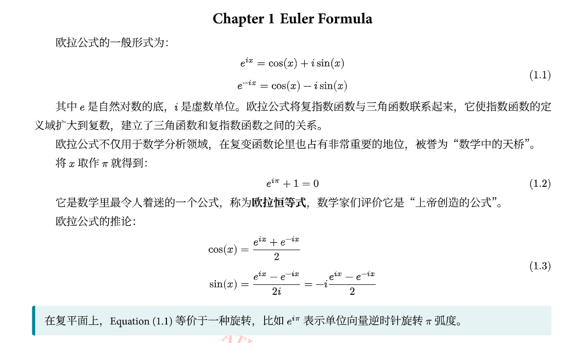
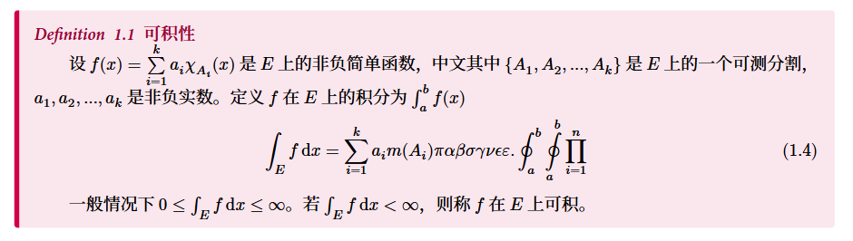
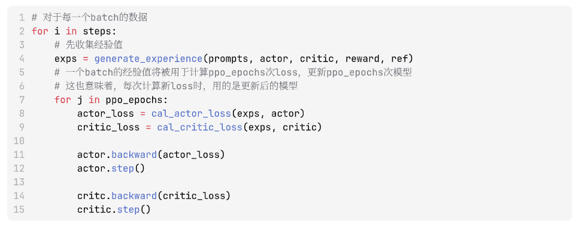
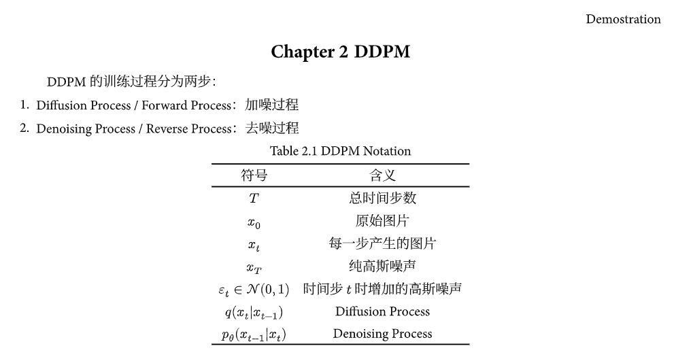

# A Typst Notebook Template

Very easy to use and customizable.

## Features

- Single template file structure  
- Support for formulas (1.1) (A.1), figures (1.1) (A.1), and three-line tables (1.1) (A.1)
- Includes：
  - cover page (optional image)
  - preface (optional)
  - table of contents
  - list of figures and tables (auto generated)
  - document body
  - references (optional)
  - appendix (optional)
  - epilogue (optional)
- Code blocks with line numbering  
- Adjustable background color for the full PDF

## Example

```typ
#import "template.typ": nice-doc, yaroxy, callout, callout-color, math-callout, math-callout-kind

#show: nice-doc.with(
  main-title: [Demostration],
  sub-title: [A Template],
  authors: (yaroxy,),
  cover-image: "image/cover.jpg",
  preface: include "chapter/preface.typ",
  reference: "chapter/ref.bib"
)
```









## Acknowledgment

Inspired by the following projects:
- [Typst Forum](https://forum.typst.app/)
- [Typst 中文社区导航](https://typst.dev/guide/)
- [Typst Examples Book](https://sitandr.github.io/typst-examples-book/book/)
- [Quite-Elegant-Typ](https://github.com/a31474/quite-elegant-typ)
- [LessElegantNote](https://github.com/choglost/LessElegantNote)
- [numbly](https://github.com/flaribbit/numbly)

Welcome to this template! Looking forward to your feedback!